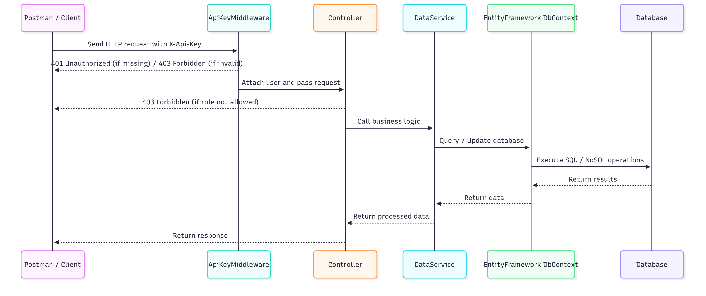

# BigShot eCommerce API

**Admin API Key:** `ef1a74e8-5fdd-48d5-9439-4386d60bd522`  
**User API Key:** `2fb5c9f8-c7dd-48bf-b4f3-d89c4fa557fa`

---
System Over View



### Data Services
All Classes that implement these interfaces are DatServices
- IChatbotService
    ```csharp
     public interface IChatbotService
        {
            Task<ChatbotResponseDto> GetRecommendationsAsync(ChatbotRequestDto request);
        }
    ```

- IOrdeService

    ```csharp
     public interface IOrderService
        {
            // CRUD
            Task<IEnumerable<OrderDto>> ListOrdersAsync(int pageSize, int pageIndex, int? userId = null);
            Task<OrderDto?> GetOrderByIdAsync(int id);
            Task<OrderDto> AddOrderAsync(CreateOrderDto dto, int UserId);
            Task<bool> UpdateOrderAsync(int id, UpdateOrderDto dto);
            Task<bool> DeleteOrderAsync(int id);

            // Optional helpers
            Task<IEnumerable<OrderDto>> SearchOrdersAsync(string keyword, int pageSize, int pageIndex);
        }
    ```


- IProductService
    ```csharp
            public interface IProductService
        {
            // -------------------- CRUD --------------------
            Task<Product> AddProductAsync(Product product); // Create
            Task<bool> DeleteProductAsync(int id); // Delete
            Task<ProductDto?> GetProductByIdAsync(int id); // Read single item as DTO
            Task<bool> UpdateProductAsync(int id, UpdateProductDto dto); // Update

            // -------------------- Listing / Utilities --------------------
            Task<IEnumerable<ProductDto>> ListProductsAsync(int pageSize, int pageIndex);
            Task<IEnumerable<ProductDto>> SearchProductsAsync(string keyword, int pageSize, int pageIndex);
            Task<IEnumerable<ProductDto>> FilterByPriceAsync(double minPrice, double maxPrice, int pageSize, int pageIndex);
            Task<IEnumerable<ProductDto>> GetInStockAsync(int pageSize, int pageIndex);
            Task<IEnumerable<ProductDto>> GetTopRatedAsync(int count);
        }
    }
    ```

- IUserService
    ```csharp
        public interface IUserService
        {
            Task<UserDto?> GetMe(AppUser currentUser);
            Task<RegisterUserResultDto?> CreateUser(RegisterUserDto dto);
            Task<IEnumerable<UserDto>> GetAllUsers();
            Task<bool> ChangeUserRole(int userId, string roleName);
            Task<bool> DeleteUser(int userId);
        }
    ```


---

## Database Models

# BigShot eCommerce Database Entities

This document outlines the database entities used in the BigShot eCommerce application, including fields, constraints, and relationships.

---

## AppRole
Represents user roles in the system (e.g., Admin, Customer).

| Field | Type | Constraints | Description |
|-------|------|-------------|-------------|
| Id    | int  | PK          | Role identifier |
| Name  | string | Required, MaxLength(50) | Role name (Admin / Customer) |
| Users | List<AppUser> | - | Users assigned to this role (1:N relationship) |

---

## AppUser
Represents a user in the system.

| Field    | Type | Constraints | Description |
|----------|------|-------------|-------------|
| Id       | int  | PK          | User identifier |
| UserName | string | Required, MaxLength(150) | Username |
| Email    | string | Required, EmailAddress | User email |
| ApiKey   | string | Required | API key (auto-generated for authentication) |
| RoleId   | int  | FK -> AppRole | Foreign key referencing user role |
| Role     | AppRole | Required | Navigation property to role |
| Orders   | List<Order> | - | Orders placed by this user (1:N relationship) |

---

## Product
Represents a product that can be purchased.

| Field                   | Type   | Constraints | Description |
|-------------------------|--------|-------------|-------------|
| Id                      | int    | PK, Identity | Product identifier |
| Name                    | string | Required, MaxLength(250) | Product name |
| ImageUrl                | string | Url, MaxLength(500) | URL of the product image |
| ShortDescription        | string | Required, MaxLength(500) | Short plain-text description |
| LongDescriptionMarkdown | string | Required | Markdown-formatted long description |
| LongDescriptionHtml     | string | - | Rendered HTML version of the long description |
| Price                   | double | Range(0.01, ∞) | Product price |
| InStock                 | int    | Range(0, ∞) | Quantity available in stock |
| Rating                  | double | Range(0.0, 5.0) | Product rating (0–5) |

---

## Order
Represents a customer's order.

| Field        | Type   | Constraints | Description |
|--------------|--------|-------------|-------------|
| OrderId      | int    | PK          | Order identifier |
| CustomerName | string | Required    | Customer's name |
| Address      | string | Required    | Delivery address |
| OrderDate    | DateTime | Default: UTC Now | Order creation date |
| Total        | decimal | -          | Total order amount |
| UserId       | int    | FK -> AppUser | Customer who placed the order |
| User         | AppUser | Required   | Navigation property to user |
| Items        | List<OrderItem> | - | List of items in this order (1:N relationship) |

---

## OrderItem
Represents an individual item within an order.

| Field           | Type   | Constraints | Description |
|-----------------|--------|-------------|-------------|
| OrderItemId     | int    | PK, Identity | Order item identifier |
| OrderId         | int    | FK -> Order | Parent order |
| ProductId       | int    | FK -> Product | Product being ordered |
| Quantity        | int    | Required    | Number of units ordered |
| PriceAtPurchase | decimal | Required   | Product price at time of purchase |
| Product         | Product | Optional   | Navigation property to product |
| Order           | Order   | Optional   | Navigation property to order |

---

## Relationships Overview
- **AppRole → AppUser:** One role can have many users (1:N)
- **AppUser → Order:** One user can place many orders (1:N)
- **Order → OrderItem:** One order can contain many order items (1:N)
- **OrderItem → Product:** Each order item references one product (N:1)

---

### Notes
- `AppUser.ApiKey` is automatically generated for API authentication.
- `Product.LongDescriptionMarkdown` stores the original Markdown content; `LongDescriptionHtml` stores the rendered HTML version for display.
- All constraints are enforced via data annotations in C# (e.g., `[Required]`, `[MaxLength]`, `[Range]`).

## Endpoints Explanation

### Chatbot
- **POST** `/api/Chatbot/recommendations`  
  **Roles:** Admin, Customer  
  **Body:** `ChatbotRequestDto`  
  **Response:** `ChatbotResponseDto`  
  **Description:** Sends a user message to the AI chatbot. The service returns AI-generated replies and product recommendations based on the user's query. Accessible to both Admins and Customers.

### Orders
- **GET** `/api/Orders/all`  
  **Roles:** Admin  
  **Query Params:** `pageSize`, `pageIndex`  
  **Description:** Retrieves all orders in the system. Only accessible by Admins. Supports pagination using query parameters.

- **GET** `/api/Orders/my-orders`  
  **Roles:** Admin, Customer  
  **Query Params:** `pageSize`, `pageIndex`  
  **Description:** Admins can view all orders, while customers can view only their own orders. Pagination is supported.

- **POST** `/api/Orders`  
  **Roles:** Customer  
  **Body:** `CreateOrderDto`  
  **Description:** Allows a customer to create a new order with details like items and shipping address. Admins cannot create orders.

- **DELETE** `/api/Orders/{id}`  
  **Roles:** Admin  
  **Description:** Deletes a specific order by ID. Only Admins can perform this action. Returns `Ok` if successful, `NotFound` if the order does not exist.

### Products
- **GET** `/api/Products/list`  
  **Roles:** Admin, Customer  
  **Description:** Lists all products with optional pagination. Accessible to both Admins and Customers.

- **GET** `/api/Products/{id}`  
  **Roles:** Admin, Customer  
  **Description:** Retrieves detailed information for a single product by its ID.

- **POST** `/api/Products`  
  **Roles:** Admin  
  **Body:** `CreateProductDto`  
  **Description:** Adds a new product to the system. Only Admins can create products.

- **PUT** `/api/Products/{id}`  
  **Roles:** Admin  
  **Body:** `UpdateProductDto`  
  **Description:** Updates an existing product. Only Admins can update products. Returns `NotFound` if the product does not exist.

- **DELETE** `/api/Products/{id}`  
  **Roles:** Admin  
  **Description:** Deletes a product by ID. Admins only.

- **GET** `/api/Products/search`  
  **Roles:** Admin, Customer  
  **Description:** Searches products by keyword. Accessible to all users.

- **GET** `/api/Products/filter`  
  **Roles:** Admin, Customer  
  **Description:** Filters products by price range. Supports pagination.

- **GET** `/api/Products/instock`  
  **Roles:** Admin, Customer  
  **Description:** Retrieves all products that are currently in stock.

- **GET** `/api/Products/toprated`  
  **Roles:** Admin, Customer  
  **Description:** Retrieves top-rated products. The number of products returned can be configured with the `count` parameter.

### Users
- **GET** `/api/Users/me`  
  **Roles:** Admin, Customer  
  **Description:** Returns the currently authenticated user's details.

- **POST** `/api/Users`  
  **Roles:** Admin  
  **Body:** `RegisterUserDto`  
  **Description:** Creates a new user and returns their API key in the response header. Only Admins can register new users.

- **GET** `/api/Users`  
  **Roles:** Admin  
  **Description:** Retrieves all users in the system. Admin-only endpoint.

- **PUT** `/api/Users/{id}/role`  
  **Roles:** Admin  
  **Description:** Changes a user's role by ID. Only Admins can modify roles.

- **DELETE** `/api/Users/{id}`  
  **Roles:** Admin  
  **Description:** Deletes a user by ID. Admin-only action.

---

## Security
All endpoints require an **API Key** in the request header:

---

# API Key Authentication & Role-Based Authorization in BigShot

## 1. API Key Authentication

**Middleware:** `ApiKeyMiddleware`

```csharp
using BigShotCore.Data.Models;
using BigShotCore.Infrastructure.Database;
using Microsoft.EntityFrameworkCore;

namespace BigShotApi.Authentication
{
    public class ApiKeyMiddleware
    {
        private readonly RequestDelegate _next;
        private const string APIKEY_HEADER = "X-Api-Key";

        public ApiKeyMiddleware(RequestDelegate next)
        {
            _next = next;
        }

        public async Task InvokeAsync(HttpContext context, AppDbContext db)
        {
            if (!context.Request.Headers.TryGetValue(APIKEY_HEADER, out var extractedApiKey))
            {
                context.Response.StatusCode = 401; // Unauthorized
                await context.Response.WriteAsync("API Key was not provided.");
                return;
            }

            // Include role with the user
            var user = await db.Users.Include(u => u.Role)
                                     .FirstOrDefaultAsync(u => u.ApiKey == extractedApiKey.ToString());

            if (user == null)
            {
                context.Response.StatusCode = 403; // Forbidden
                await context.Response.WriteAsync("Invalid API Key.");
                return;
            }

            // Attach user to HttpContext for controller access
            context.Items["User"] = user;

            await _next(context);
        }
    }
}
```

* **Purpose:** Validate incoming HTTP requests for a valid API key.
* **Header used:** `X-Api-Key`
* **How it works:**
  1. Checks if the request contains the `X-Api-Key` header:
     ```csharp
     if (!context.Request.Headers.TryGetValue(APIKEY_HEADER, out var extractedApiKey))
     ```
     * If missing → responds with `401 Unauthorized`.
  2. Looks up the user in the database, including their role:
     ```csharp
     var user = await db.Users.Include(u => u.Role)
                              .FirstOrDefaultAsync(u => u.ApiKey == extractedApiKey.ToString());
     ```
     * If not found → responds with `403 Forbidden`.
  3. Attaches the authenticated user to `HttpContext.Items["User"]`:
     ```csharp
     context.Items["User"] = user;
     ```
     * Allows controllers and filters to access the authenticated user.

* **Key Points:**
  * Only requests with a valid API key can reach protected endpoints.
  * Middleware runs **before the controller action**, ensuring all downstream code has access to the authenticated user.

---

## 2. Role-Based Authorization

### a) `[AuthorizeRole("Role1", "Role2")]`

* **Purpose:** Restrict access to one or more roles.
* **Implementation:** Implements `IAsyncActionFilter`.
* **Mechanism:**
  1. Retrieves the user from `HttpContext`:
     ```csharp
     var user = context.HttpContext.GetCurrentUser();
     ```
  2. Checks if the user exists and their role matches allowed roles:
     ```csharp
     if (user == null || !_roles.Contains(user.Role.Name))
         context.Result = new ForbidResult();
     ```
  3. If role matches → request continues to the controller action.

* **Usage Examples:**
  ```csharp
  [AuthorizeRole("Customer")]
  public async Task<IActionResult> AddOrder(...)

  [AuthorizeRole("Admin", "Customer")]
  public async Task<IActionResult> ListMyOrders(...)
  ```

### b) `[RequireRole("Role")]`

* **Purpose:** Restrict access to exactly one role.
* **Mechanism:** Uses `HttpContext.Items["User"]` set by `ApiKeyMiddleware`.
* **Check:**
  ```csharp
  if (!string.Equals(user.Role.Name, _role, StringComparison.OrdinalIgnoreCase))
      context.Result = new ForbidResult();
  ```

---

## 3. Integration Flow

1. **Incoming Request:** Client sends a request with `X-Api-Key`.
2. **Middleware:** `ApiKeyMiddleware` validates API key and fetches user + role.
3. **Controller Action:** `[AuthorizeRole]` or `[RequireRole]` checks user role.
4. **Outcome:**
   * ✅ Valid API key + allowed role → request proceeds.
   * ❌ Invalid API key → `401 Unauthorized` or `403 Forbidden`.
   * ❌ Role not allowed → `403 Forbidden`.

---

### Summary Table

| Layer              | Responsibility                 | Failure Result  |
|--------------------|-------------------------------|-----------------|
| `ApiKeyMiddleware` | Validate API key and load user | `401/403`       |
| `[AuthorizeRole]`  | Allow multiple roles           | `403 Forbidden` |
| `[RequireRole]`    | Allow exactly one role         | `403 Forbidden` |

---
